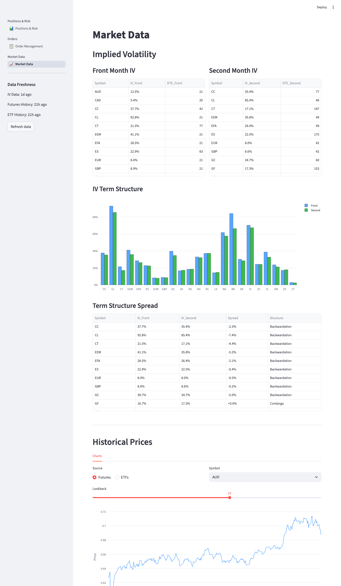
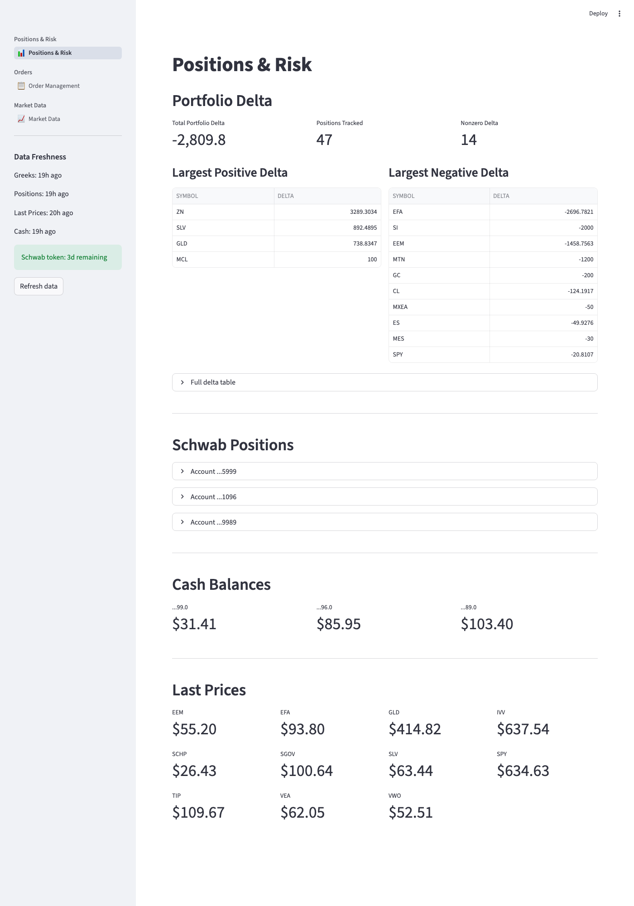

# IB Data Tools

Python utilities for Interactive Brokers (IB) TWS API. Covers market data collection, portfolio analytics, automated order management, and a Streamlit trading dashboard. All scripts share the same EWrapper/EClient callback-driven architecture.

## Requirements

```bash
pip install ibapi openpyxl
```

The trading dashboard additionally requires:

```bash
pip install streamlit pandas plotly
```

All scripts require TWS (Trader Workstation) or IB Gateway running locally.

## Connection Ports

| Port | Description |
|------|-------------|
| `7497` | TWS paper trading (default) |
| `7496` | TWS live trading |
| `4002` | IB Gateway |

Edit the configuration block near the top of each script to change ports, file paths, or output options.

## Architecture

All scripts inherit from both `EWrapper` (receives async callbacks) and `EClient` (sends API requests). IB's API is callback-driven: you call `reqXxx()` methods and receive results in overridden callback methods. Each script runs `app.run()` on a daemon thread to process incoming messages.

---

## Data Collection

### `futures_data_grabber_v2.py`

Downloads historical daily data for a list of continuous futures contracts and writes to an Excel workbook. Uses a two-phase batched connection approach:

- **Phase 1**: Downloads 1 month of data for symbols already in the workbook (validation)
- **Phase 2**: Downloads 3 years of data for any symbols that failed validation or are new

A single IB connection is reused for all symbols, making it roughly 10x faster than reconnecting per symbol.

**Input**: `futures_historical_data.csv` (SYMBOL, EXCHANGE, CONID columns)

**Output**: `futures_combined.xlsx`

### `get_conids.py`

Resolves contract symbols to Interactive Brokers ConIDs (contract identifiers) and writes results to Excel. Useful for setting up input files for other scripts.

**Input**: `conid_inputs.csv` (SYMBOL, EXCHANGE columns)

**Output**: `conid_outputs.xlsx`

### `get_last_prices.py`

Fetches current last prices for a list of contracts (by ConID) and writes to Excel. Supports a background/daemon mode where the Terminal window closes automatically after launch.

**Input**: `last_inputs.csv` (SYMBOL, CONID columns)

**Output**: `last_outputs.xlsx`

### `implied_volatility_grabber_v2.py`

Fetches implied volatility for the two nearest monthly option expirations from TWS. Uses a four-phase approach: resolve underlying contracts, fetch option chain parameters (expirations and strikes), resolve ATM option contracts to get conIds, then subscribe to market data and collect IV.

**Input**: CSV file with SYMBOL, EXCHANGE, CONID columns

**Output**: Excel file with Symbol, IV_Front, IV_Second, Expiry_Front, Expiry_Second, DTE_Front, DTE_Second columns

---

## Portfolio Analytics

### `aggregate_greeks.py`

Reads a CSV of positions (ETFs, futures, options), connects to IB, fetches live position quantities and market data, computes contract delta per position, and writes a summary table to Excel. Useful for getting a portfolio-wide delta snapshot across multiple instrument types.

**Input**: CSV with SYMBOL, EXCHANGE, CONID columns

**Output**: `greeks_output.xlsx`

---

## Order Management

### `SPY_short_options_orders.py`

Reads SPY option contracts from CSV and creates REL (relative) orders with time conditions. Orders are created untransmitted for manual review in TWS before sending.

**Input**: `SPY_short_options.csv`

### `futures_orders_from_csv.py`

Reads futures contract specifications from CSV and creates conditional market orders with Adaptive algo routing and time conditions. Orders are created untransmitted for manual review.

**Input**: CSV with SYMBOL, CONID, EXCHANGE, TIME columns

### `generic_lmt_order.py`

Reads contract IDs from CSV and creates limit orders with a specified action and price. By default orders are untransmitted; use `--transmit` to auto-send.

**Input**: `generic_lmt_input.csv`

### `adjust_ib_orders_v2.py`

Places new limit orders and continuously adjusts their prices based on a tiered schedule. Reads an Excel file specifying contracts, fetches market prices, places orders (untransmitted), asks for confirmation, transmits, then runs an adjustment loop. Supports three pricing tiers with configurable deltas, time intervals, and price thresholds.

**Input**: Excel file with CONID, ACTION, QTY, and tier columns (DELTA1/TIME1/PRICE1, etc.)

### `get_ib_open_orders.py`

Fetches all working orders from TWS/IB Gateway and exports them to Excel. Supports command-line flags for port selection, client ID, and showing all orders (including API-placed).

**Output**: `ib_open_orders.xlsx`

```bash
python3 get_ib_open_orders.py              # default port 7497
python3 get_ib_open_orders.py -p 7496      # live trading
python3 get_ib_open_orders.py --show-all   # include API orders
```

---

## Options Buy-Back

A set of three scripts for managing GTC limit buy orders that close short options positions.

### `option_buy_back.py`

Automatically places GTC LMT BUY orders to close short options positions. Scans existing open orders for buy-backs already in place, downloads portfolio positions, computes the delta between what should exist and what does, then places paired call+put orders with order splitting for large quantities.

**Input**: `buy_back_input.csv` (symbol, exchange, OrderSize, priceIncrement, orderType, tif, auxPrice, lmtPrice, transmit)

**Configuration**: Set your IB account ID in the `ACCOUNTS` list at the top of the script.

### `balance_checker.py`

Checks all open buy-back orders for call/put imbalances at each strike. When one side of a paired buy-back fills, the orphaned counterpart should be canceled. Lists orphaned orders and optionally cancels them.

```bash
python3 balance_checker.py          # list orphans, prompt before canceling
python3 balance_checker.py -y       # cancel orphans without prompting
```

### `refresh_buy_back_gat.py`

Updates the `goodAfterTime` field on all existing buy-back orders to the next market open (09:35 Eastern). Useful for refreshing stale orders so they activate at the correct time. Skips futures options since futures exchanges reject `goodAfterTime` on GTC orders.

---

## Trading Dashboard

A multi-page Streamlit app that reads output files from the IB scripts and displays positions, orders, and market data in a single browser interface.

```bash
cd trading-dashboard
streamlit run app.py
```

### Pages

- **Positions & Risk** (`pages/positions.py`): Portfolio delta breakdown, Schwab positions, cash balances, last prices, and Schwab token health.
- **Order Management** (`pages/orders.py`): Working orders across IB and Schwab with buy/sell counts and order type summaries.
- **Market Data** (`pages/market_data.py`): Implied volatility tables, IV term structure bar charts (contango/backwardation), and interactive historical price charts with configurable lookback.

### Screenshots

**Market Data page** showing IV term structure and historical price charts:



**Positions & Risk page** showing portfolio delta and cash balances:



---

## Input File Formats

**`futures_historical_data.csv`** (futures downloader):
```
SYMBOL,EXCHANGE,CONID
CL,NYMEX,
GC,COMEX,
ES,CME,
```

**`conid_inputs.csv`** (ConID resolver):
```
SYMBOL,EXCHANGE
CL,NYMEX
GC,COMEX
```

**`last_inputs.csv`** (last price fetcher):
```
SYMBOL,CONID
SPY,756733
GLD,51529211
```

## License

MIT
